# Example-macOS

An example of how to use Apple development GitHub Actions to test a macOS app, upload it to TestFlight, and ship a notarized Developer ID DMG on a GitHub Release.

The workflow lives at [`.github/workflows/build-macos-app.yml`](.github/workflows/build-macos-app.yml). On every push:

- All branches: run the unit tests (Debug, ad-hoc signed, no secrets needed). Forks and pull requests stop here.
- `prod`: archive once, then export twice. The App Store export becomes a `.pkg` uploaded to TestFlight. The Developer ID export is packaged into a DMG, which is signed, notarized, stapled, uploaded as a workflow artifact, and attached to a GitHub Release.

Build logs are uploaded as a workflow artifact on failure or cancellation.

```mermaid
flowchart LR
  test["xcodebuild test"] --> certs["import-codesign-certs"]
  certs --> profiles["download-provisioning-profiles"]
  profiles --> archive["xcodebuild archive + App Store export"]
  archive --> tf["upload-testflight-build"]
  tf --> devid["xcodebuild action: export (Developer ID)"]
  devid --> dmg["hdiutil + codesign the DMG"]
  dmg --> notarize["notarize"]
  notarize --> release["upload-artifact + gh release"]
```



| Step | Uses | Notes |
| --- | --- | --- |
| Run Tests | [`Apple-Actions/xcodebuild@v1`](https://github.com/Apple-Actions/xcodebuild) | `action: test`, `destination: platform=macOS`, Debug |
| Import Code Signing Certificates | [`Apple-Actions/import-codesign-certs@v7`](https://github.com/Apple-Actions/import-codesign-certs) | One `.p12` holding all three identities |
| Download Provisioning Profiles | [`Apple-Actions/download-provisioning-profiles@v7`](https://github.com/Apple-Actions/download-provisioning-profiles) | No `profile-type`, so it fetches both profiles |
| Check Provisioning Profiles | `run:` | `jq` over the `profiles` output; fails early if either profile is missing |
| Archive and Export for App Store | `Apple-Actions/xcodebuild@v1` | `action: archive` with [`ExportOptions.plist`](ExportOptions.plist) |
| Upload TestFlight Build | [`Apple-Actions/upload-testflight-build@v5`](https://github.com/Apple-Actions/upload-testflight-build) | `pkg-path` output, `app-type: macos`, `backend: altool` |
| Export Developer ID | `Apple-Actions/xcodebuild@v1` | `action: export` of the same archive with [`ExportOptions-DeveloperID.plist`](ExportOptions-DeveloperID.plist) |
| Package DMG | `run:` | `hdiutil`, then `codesign --timestamp` by certificate hash |
| Notarize DMG | [`Apple-Actions/notarize@v1`](https://github.com/Apple-Actions/notarize) | Submits, waits, staples and verifies |
| Upload DMG / Create GitHub Release | `actions/upload-artifact@v7`, `gh release create` | Tag `v<MARKETING_VERSION>-<run number>` |

### Why one archive with two exports

Archiving once and exporting twice means the DMG holds exactly the same binary as the TestFlight build, and the archive's dSYMs symbolicate crashes from both channels. Two separate archives would produce two different binaries with two sets of dSYMs.

### Step order

TestFlight runs before the DMG, so an outage at Apple's notary service can't block a TestFlight upload. The trade-off is that re-running a job that failed during notarization uploads to TestFlight again, which fails because the build number already exists. If re-runs must never upload twice, move the Package DMG and Notarize steps above Upload TestFlight Build. Either order works; pick one deliberately.

## The app

`ExampleMac` is a minimal SwiftUI app that embeds a small `ExampleKit` framework, so the export has nested code to re-sign. `ExampleMacTests` tests `ExampleKit`'s `Greeting.message(for:count:)`, the string the app shows.

Settings live in [`Config/Shared.xcconfig`](Config/Shared.xcconfig): version, bundle ID `codes.orj.ExampleMac`, team, `ARCHS = arm64`, and the hardened runtime. Release signing is Manual with `Apple Distribution` and the `AppStore codes.orj.ExampleMac` profile. Debug signs ad-hoc (`-`), so tests run without certificates. The app has the App Sandbox entitlement.

## Required repo configuration

Secrets live under Settings → Secrets and variables → Actions → **Secrets**; variables under the **Variables** tab.

Use the same ENV names as the [Apple-Actions setup scripts](https://github.com/Apple-Actions/download-provisioning-profiles#canonical-github-envs):

| Kind | Name | Contents |
| --- | --- | --- |
| Variable | `APPSTORE_ISSUER_ID` | App Store Connect API issuer ID |
| Variable | `APPSTORE_API_KEY_ID` | API key ID. Admin role if the key also creates profiles; Developer is enough to download profiles, upload, and notarize |
| Secret | `APPSTORE_API_PRIVATE_KEY` | Contents of the `.p8` key |
| Secret | `APPSTORE_CERTIFICATES_FILE_BASE64` | base64 of the combined `.p12` |
| Secret | `APPSTORE_CERTIFICATES_PASSWORD` | Password of the `.p12` |

## One-time Apple setup

1. **Bundle ID and app.** Register `codes.orj.ExampleMac` and create the macOS app in App Store Connect. The API can't create apps.
2. **Certificates.** You need three:
   - **Apple Distribution** signs the app.
   - **Mac Installer Distribution** signs the TestFlight `.pkg`. Export options call it `3rd Party Mac Developer Installer`; both names mean the same certificate.
   - **Developer ID Application** signs the DMG build. Only the Account Holder can create it, and the API returns 403 `FORBIDDEN_ERROR` for any other key. Generate the private key and CSR locally, have the Account Holder upload the CSR in the developer portal, and keep the key.
3. **Provisioning profiles.** The names must match the export plists and [`Config/Shared.xcconfig`](Config/Shared.xcconfig):
   - `AppStore codes.orj.ExampleMac` (`MAC_APP_STORE`, Apple Distribution certificate)
   - `DeveloperID codes.orj.ExampleMac` (`MAC_APP_DIRECT`, Developer ID Application certificate)

   Recreate them after renewing or revoking a certificate: they turn INVALID, and only ACTIVE profiles are downloaded.
4. **One `.p12` with all three identities.** `openssl pkcs12` holds only one private key, so use a throwaway keychain:

   ```bash
   security create-keychain -p tmp export.keychain
   security import distribution.p12 -k export.keychain -P "$PASS1"
   security import installer.p12 -k export.keychain -P "$PASS2"
   security import developer-id.p12 -k export.keychain -P "$PASS3"
   security export -k export.keychain -t identities -f pkcs12 -P "$P12_PASSWORD" -o all.p12
   security delete-keychain export.keychain
   base64 -i all.p12 | pbcopy   # APPSTORE_CERTIFICATES_FILE_BASE64
   ```
5. **Secrets and variables.** Set the table above. [`scripts/setup.sh`](https://github.com/Apple-Actions/download-provisioning-profiles#one-shot-setup) can create the App Store certificate, profile, and GitHub ENVs for you; the Developer ID certificate still needs the Account Holder.

To use this for your own app, replace `codes.orj.ExampleMac` and `ER9FN723RR` in `Config/Shared.xcconfig`, both export plists, and the workflow.

## Troubleshooting

- **`error: exportArchive "ExampleMac.app" requires a provisioning profile.`** on Export Developer ID. The `DeveloperID` profile is missing or not mapped in `ExportOptions-DeveloperID.plist`. The archive was signed with the App Store profile, so it carries `com.apple.application-identifier`, and every export of it needs a profile for that method.
- **`ambiguous` from `codesign`.** Two certificates in the keychain share a name, usually after a renewal. Sign by SHA-1 hash, as the Package DMG step does.
- **Notarization `Invalid`.** Read the log that the notarize action prints. Common causes are a missing hardened runtime, an unsigned nested binary, or a signature without a secure timestamp.
- **TestFlight upload rejects the `.pkg`.** The default `appstore-api` backend only uploads `.ipa` files. Use `backend: altool` or `backend: transporter` for macOS.
- **Order of TestFlight and the DMG.** See [Step order](#step-order).

## Running locally

The same steps without the actions, with the certificates and profiles installed:

```bash
xcodebuild -project ExampleMac.xcodeproj -scheme ExampleMac -configuration Debug -destination platform=macOS test

xcodebuild -project ExampleMac.xcodeproj -scheme ExampleMac -sdk macosx \
  -archivePath .build/ExampleMac.xcarchive archive
xcodebuild -exportArchive -archivePath .build/ExampleMac.xcarchive \
  -exportOptionsPlist ExportOptions-DeveloperID.plist -exportPath .build/developer-id

mkdir -p .build/dmg/staging
cp -R .build/developer-id/ExampleMac.app .build/dmg/staging/
ln -s /Applications .build/dmg/staging/Applications
hdiutil create -format UDZO -volname ExampleMac -srcfolder .build/dmg/staging -ov .build/ExampleMac.dmg
codesign --sign "<Developer ID Application hash>" --timestamp .build/ExampleMac.dmg

xcrun notarytool submit .build/ExampleMac.dmg --keychain-profile <profile> --wait
xcrun stapler staple .build/ExampleMac.dmg
spctl -a -t open --context context:primary-signature -v .build/ExampleMac.dmg   # source=Notarized Developer ID
```
